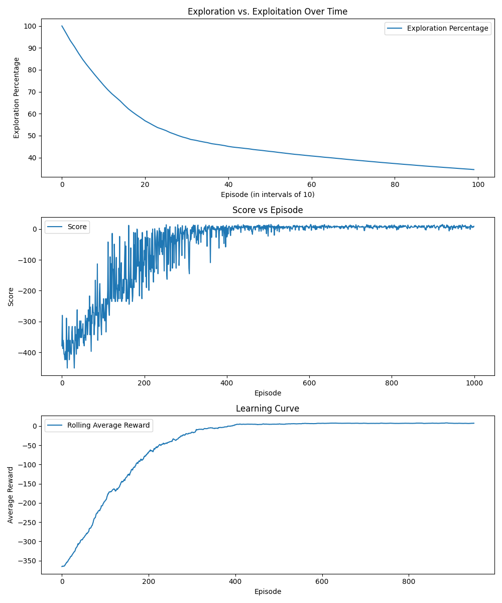
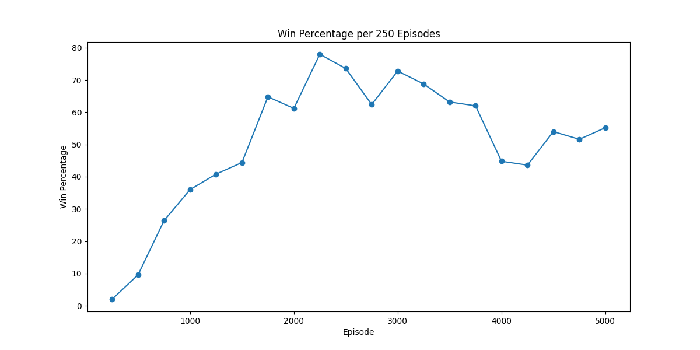
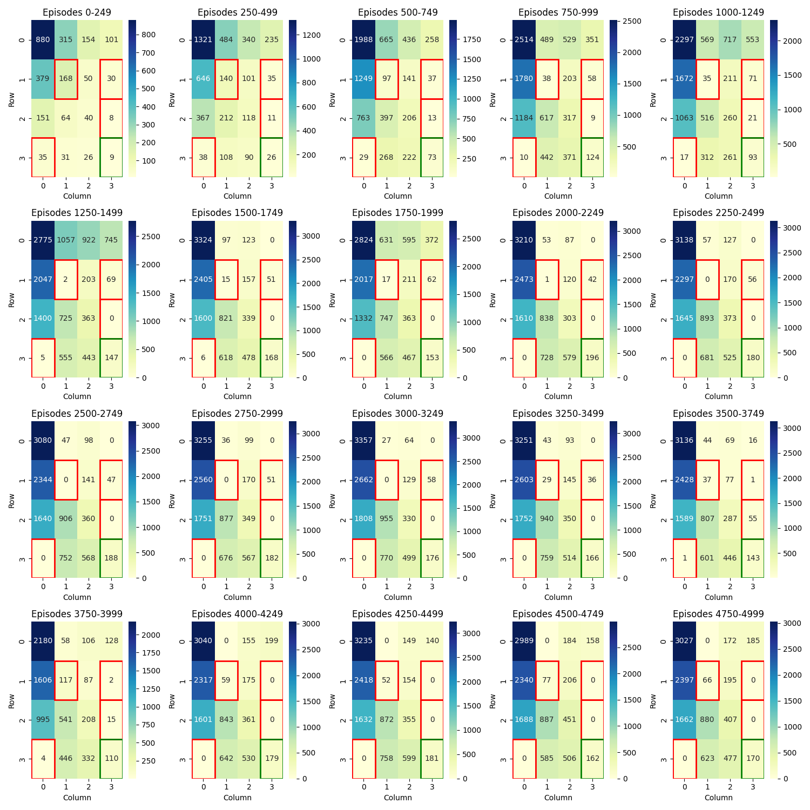
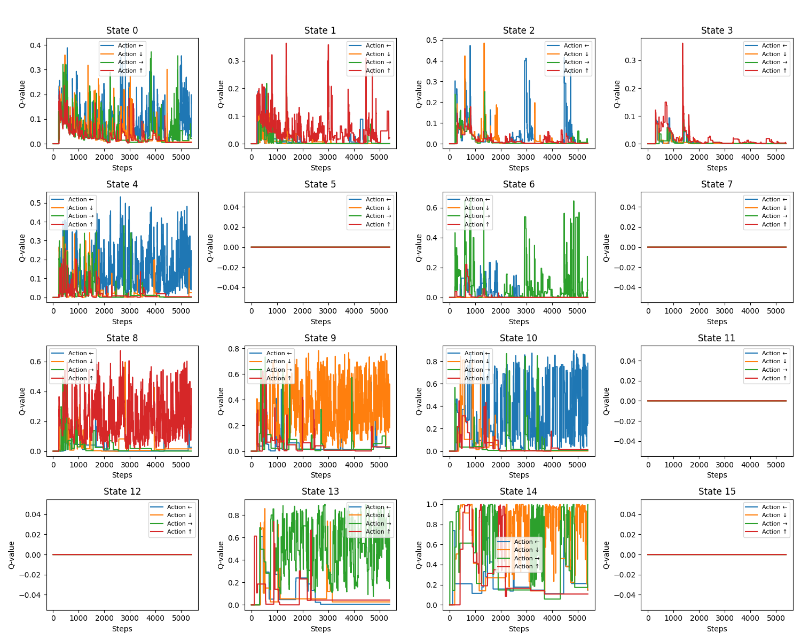
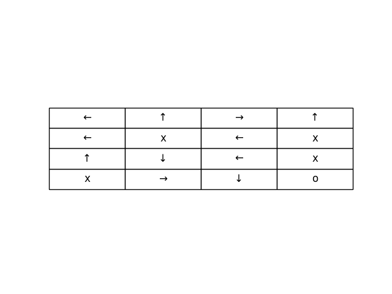
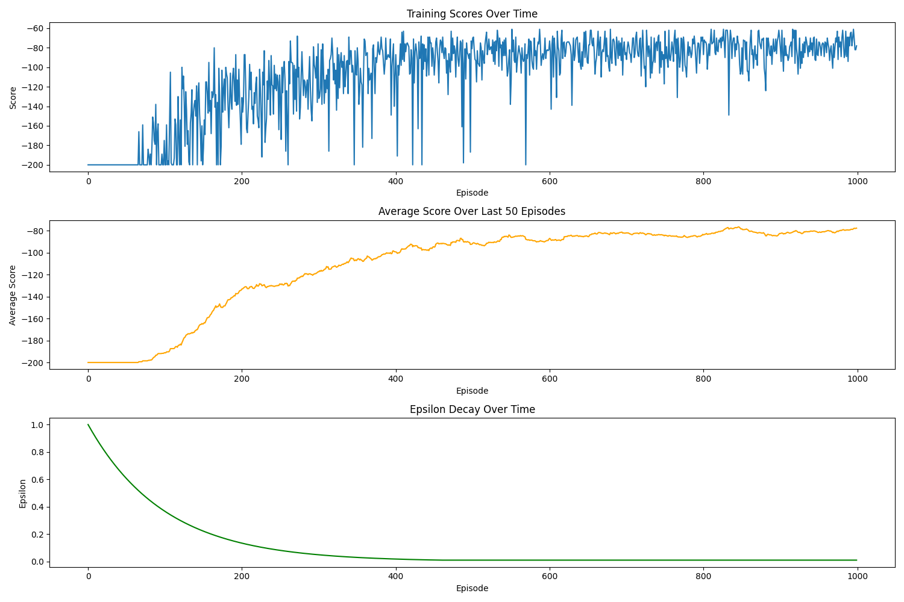
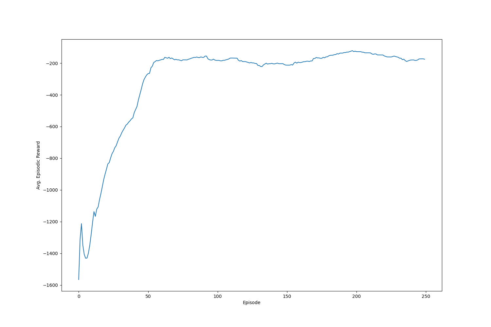

# TODO:
- [ ] Check and fix installation of packages and running of programm

# Japan Internship: Gymnasium

## Introduction
This repository contains the code for my Summer internship at Muroran Institute of Technology in Japan.
The main goal of this internship was to get a better understanding of Reinforcement Learning and to implement some of the most common algorithms in the Gymnasium environment.

I mainly focused on the following algorithms:
- Q-Learning
- Deep Q-Networks (DQN)
- Deep Deterministic Policy Gradients (DDPG)

___ 

## Table of Contents
1. [Introduction](#introduction)
2. [Installation](#installation)
3. [Usage](#usage)
4. [Implementation Details](#implementation-details)
   - [Q-Learning for Taxi and FrozenLake Environments](#q-learning-for-taxi-and-frozenlake-environments)
   - [DQN for Acrobot](#dqn-for-acrobot)
   - [DDPG for Pendulum](#ddpg-for-pendulum)
5. [Visualization](#visualization)
6. [Future Plans](#future-plans)
7. [References](#references)

___

## Installation
To install the required packages run the following command:
```bash
pip install -r requirements.txt
```

___

## Usage
To run the training of the different algorithms navigate to the corresponding folder and run the following command:
```bash
python ./train_<environment>.py
```
Replace `<environment>` with the environment you want to train the algorithm on.

To run the trained model and render the environment, navigate to the corresponding folder and run the following command:
```bash
python ./trained_<environment>.py
```
Replace `<environment>` with the environment you want to train the algorithm on.
___
## Implementation Details

### Q-Learning for Taxi and FrozenLake Environments

#### Algorithm Overview
- **Q-Learning**: Foundational algorithm in RL that seaks to learn the value of state-action pairs to determine the best policy. Works great for smaller problems with discrete state and action spaces.

#### Taxi Environment
- **Environment Description**: The Taxi environment involves navigating a gridworld to pick up and drop off passengers at designated locations. The state space is discrete, consisting of the taxi's position, the passenger's location, and the destination. For more details, refer to the [Gymnasium Taxi documentation](https://gymnasium.farama.org/v1.0.0a2/environments/toy_text/taxi/).

#### FrozenLake Environment
- **Environment Description**: The FrozenLake environment involves navigating a grid to reach a goal while avoiding holes. The state space is discrete, with each state representing a position on the grid. For more details, refer to the [Gymnasium FrozenLake documentation](https://gymnasium.farama.org/v1.0.0a2/environments/toy_text/frozen_lake/).

  - I set is_slippery=True: If true the player will move in intended direction with probability of 1/3 else will move in either perpendicular direction with equal probability of 1/3 in both directions.
  For example, if action is left and is_slippery is True, then:
  P(move left)=1/3
  P(move up)=1/3
  P(move down)=1/3

### DQN for Acrobot

#### Algorithm Overview
- **Deep Q-Network (DQN)**: An extention of Q-Learning that uses Deep Neural Networks to approximate the Q-Values, enabling it to handle high-dimensional (and continious) state spaces.
DQN uses Experience Replay and Target Networks to stabilize the learning process.
To learn more about DQN, refer to the Deep Mind Paper [Playing Atari with Deep Reinforcement Learning](https://arxiv.org/pdf/1312.5602)

#### Acrobot Environment
- **Environment Description**: The Acrobot environment involves swinging a two-link pendulum to reach a target height. The state space is continuous, representing joint angles and velocities. For more details, refer to the [Gymnasium Acrobot documentation](https://gymnasium.farama.org/v1.0.0a2/environments/classic_control/acrobot/).

### DDPG for Pendulum

#### Algorithm Overview
- **Deep Deterministic Policy Gradient (DDPG)**: DDPG uses an actor-critic architecture, deterministic policy gradients, and experience replay to learn continuous actions.
  - Recommended Research Papers:
    - [Deterministic Policy Gradient Algorithms](https://proceedings.mlr.press/v32/silver14.pdf)
    - [CONTINUOUS CONTROL WITH DEEP REINFORCEMENT LEARNING](https://arxiv.org/pdf/1509.02971)

#### Pendulum Environment
- **Environment Description**: The Pendulum environment involves balancing a pendulum upright. The state space is continuous, representing the pendulum’s angle and angular velocity. For more details, refer to the [Gymnasium Pendulum documentation](https://gymnasium.farama.org/v1.0.0a2/environments/classic_control/acrobot/).

___

## Visualization

### Q-Learning
#### Taxi


#### FrozenLake





Results for this Environment vary drastically due to the stochastic state transitions.

### DQN
#### Accrobat


### DDPG

#### Pendulum

___

## Future plans
- [ ] Implement DDPG Algorithm from scratch.

___

### References
- [Gymnasium Docs](https://gymnasium.farama.org/)
- [Pendulum Tutorial](https://keras.io/examples/rl/ddpg_pendulum/) My DDPG implementation is HIGHLY "inspired" by this tutorial!