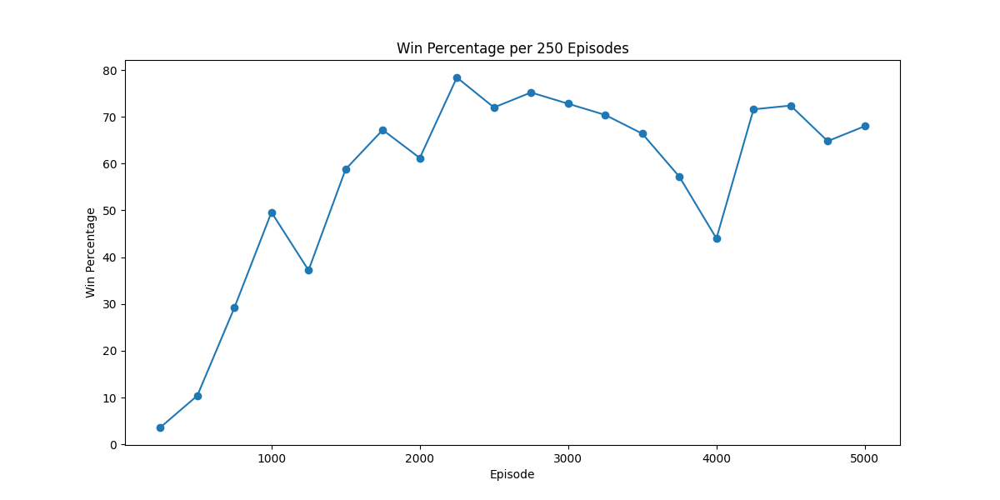

# Japan Internship: Gymnasium
## Introduction
This repository contains the code for my Summer internship at Muroran Institute of Technology in Japan.
The main goal of this internship was to get a better understanding of Reinforcement Learning and to implement some of the most common algorithms in the Gymnasium environment.

I mainly focused on the following algorithms:
- Q-Learning
- Deep Q-Networks (DQN)
- Deep Deterministic Policy Gradients (DDPG)

## Table of Contents
1. [Introduction](#introduction)
2. [Installation](#installation)
3. [Usage](#usage)
4. [Implementation Details](#implementation-details)
5. [Experimentation and Results](#experimentation-and-results)
6. [Project Structure](#project-structure)
7. [Contributions](#contributions)
8. [Future Work](#future-work)
9. [References](#references)
10. [License](#license)

TODO: Check and fix installation of packages and running of programm
## Installation
To install the required packages run the following command:
```bash
pip install -r requirements.txt
```
## Usage
To run the training of the different algorithms navigate to the corresponding folder and run the following command:
```bash
python ./train_<environment>.py
```
Replace `<environment>` with the environment you want to train the algorithm on.

To run the trained model and render the environment, navigate to the corresponding folder and run the following command:
```bash
python ./trained_<environment>.py
```
Replace `<environment>` with the environment you want to train the algorithm on.


## Q-Learning

### Taxi
To get a feel for Q-Learning I started with an implementation in the Taxi Environment.


### FrozenLake
In Frozenlake my main focus was on visualizing the learning process.



## DQN

### Accrobat

## DDPG

### Pendulum

### References
- [Gymnasium Docs](https://gymnasium.farama.org/)