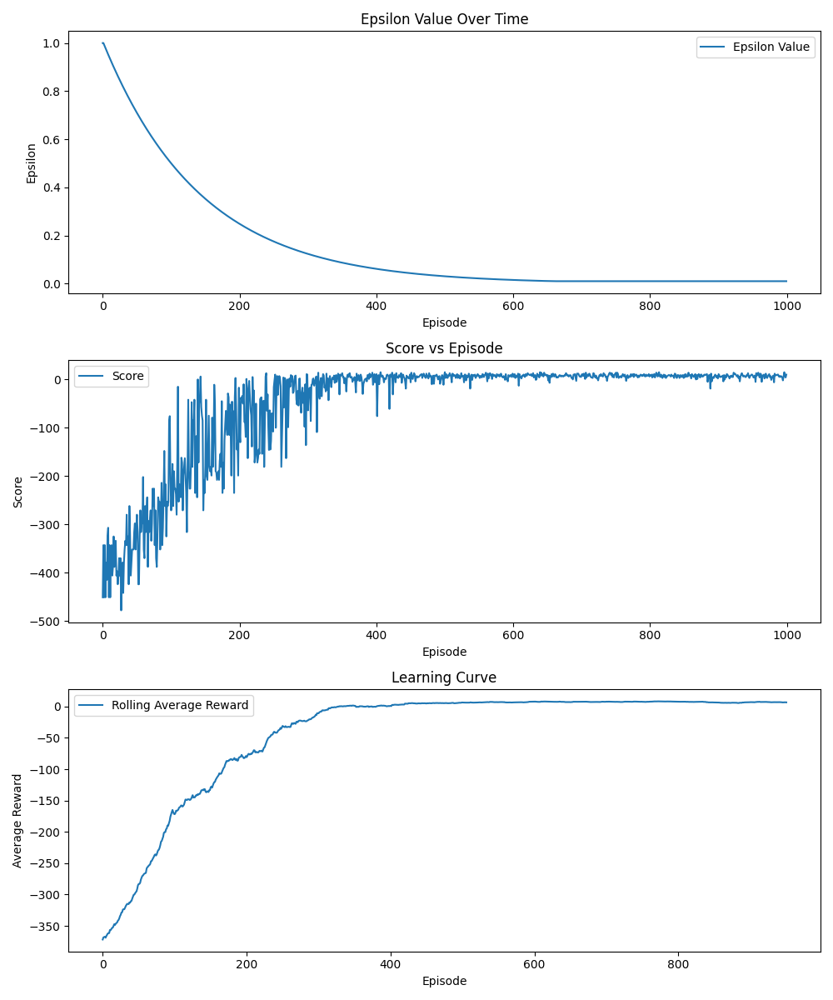

# TODO:
- [ ] Check and fix installation of packages and running of programm
- [ ] Add implementation details for each Environment?
- [ ] Improve Qlearning Section and add Formula


# Japan Internship: Gymnasium

## Introduction
This repository contains the code for my Summer internship at Muroran Institute of Technology in Japan.
The main goal of this internship was to get a better understanding of Reinforcement Learning and to implement some of the most common algorithms in the Gymnasium environment.

I mainly focused on the following algorithms:
- Q-Learning
- Deep Q-Networks (DQN)
- Deep Deterministic Policy Gradients (DDPG)
___ 
## Table of Contents
1. [Introduction](#introduction)
2. [Installation](#installation)
3. [Usage](#usage)
4. [Implementation Details](#implementation-details)
5. [Experimentation and Results](#experimentation-and-results)
6. [Project Structure](#project-structure)
7. [Contributions](#contributions)
8. [Future Work](#future-work)
9. [References](#references)
10. [License](#license)
___

## Installation
To install the required packages run the following command:
```bash
pip install -r requirements.txt
```
## Usage
To run the training of the different algorithms navigate to the corresponding folder and run the following command:
```bash
python ./train_<environment>.py
```
Replace `<environment>` with the environment you want to train the algorithm on.

To run the trained model and render the environment, navigate to the corresponding folder and run the following command:
```bash
python ./trained_<environment>.py
```
Replace `<environment>` with the environment you want to train the algorithm on.
___
## Implementation Details


### Q-Learning for Taxi and FrozenLake Environments

#### Algorithm Overview
- **Q-Learning**: Q-Learning is a model-free reinforcement learning algorithm that aims to learn the optimal action-value function \(Q(s, a)\) by iteratively updating Q-values using the Bellman equation.

#### Taxi Environment
- **Environment Description**: The Taxi environment involves navigating a gridworld to pick up and drop off passengers at designated locations. The state space is discrete, consisting of the taxi's position, the passenger's location, and the destination. For more details, refer to the [Gymnasium Taxi documentation](https://gymnasium.farama.org/v1.0.0a2/environments/toy_text/taxi/).

#### FrozenLake Environment
- **Environment Description**: The FrozenLake environment involves navigating a grid to reach a goal while avoiding holes. The state space is discrete, with each state representing a position on the grid. For more details, refer to the [Gymnasium FrozenLake documentation](https://gymnasium.farama.org/v1.0.0a2/environments/toy_text/frozen_lake/).

### DQN for Acrobot and MountainCar

#### Algorithm Overview
- **Deep Q-Network (DQN)**: DQN uses a neural network to approximate the Q-value function and experience replay and Target Networks to stabilize training by storing and reusing past experiences.[DQN Paper grgrygerygergeg!!!](!THorstengrguyergherugherugerhguerhgi)
DQN enables us to work with non deterministic State spaces....!!!!

#### Acrobot Environment
- **Environment Description**: The Acrobot environment involves swinging a two-link pendulum to reach a target height. The state space is continuous, representing joint angles and velocities. For more details, refer to the [Gymnasium Acrobot documentation](https://gymnasium.farama.org/v1.0.0a2/environments/classic_control/acrobot/).
- **Implementation**:
  - **State Representation**: States are represented as continuous values for joint angles and velocities.
  - **Action Space**: Actions include applying torque to the joints.
  - **Neural Network Architecture**: The neural network consists of several fully connected layers with ReLU activations.
  - **Replay Buffer**: The replay buffer stores past experiences, with a size of 50,000.
  - **Target Network**: A target network is updated every 1,000 steps to stabilize training.
  - **Hyperparameters**:
    - Learning rate: 0.001
    - Discount factor: 0.99
    - Exploration rate: Starts at 1.0, decayed to 0.01
    - Batch size: 64
  - **Training Procedure**: Experiences are stored in the replay buffer, minibatches are sampled for training, and network weights are updated using gradient descent.

#### MountainCar Environment
- **Environment Description**: The MountainCar environment involves driving a car up a steep hill. The state space is continuous, representing the car's position and velocity. For more details, refer to the [Gymnasium MountainCar documentation](https://gymnasium.farama.org/v1.0.0a2/environments/classic_control/mountain_car/).
- **Implementation**:
  - **State Representation**: States are represented as continuous values for the car’s position and velocity.
  - **Action Space**: Actions include pushing left, no push, and pushing right.
  - **Neural Network Architecture**: The neural network consists of several fully connected layers with ReLU activations.
  - **Replay Buffer**: The replay buffer stores past experiences, with a size of 50,000.
  - **Target Network**: A target network is updated every 1,000 steps to stabilize training.
  - **Hyperparameters**:
    - Learning rate: 0.001
    - Discount factor: 0.99
    - Exploration rate: Starts at 1.0, decayed to 0.01
    - Batch size: 64
  - **Training Procedure**: Experiences are stored in the replay buffer, minibatches are sampled for training, and network weights are updated using gradient descent.


## Q-Learning

### Taxi
To get a feel for Q-Learning I started with an implementation in the Taxi Environment.



### FrozenLake
In Frozenlake my main focus was on visualizing the learning process.


## DQN

### Accrobat

## DDPG

### Pendulum


### References
- [Gymnasium Docs](https://gymnasium.farama.org/)